<!-- NAME / TAGLINE - animated text -->

 

<!-- SOCIALS -->
&nbsp;&nbsp;
&nbsp;&nbsp;

 

---

## About Me

Hi, I'm **Hamza**, a software engineering student at **ENIT** (Tunisia), pursuing a dual degree with a Research Master's in *Information Systems Technology*.

---

## Tech Stack

**AI / ML:** LLM (Ollama, Qwen) · RAG · ChromaDB · Scikit-learn · Random Forest · SVM
**Backend:** FastAPI · Java EE · JPA · Quarkus · WildFly · Entity Framework Core
**Tools:** Docker · CI/CD (GitHub Actions, GitLab CI) · Domain-Driven Design · QGIS · Google Earth Engine

---

## Featured Projects

- **AI Project Planning Simulator** (Axe Finance) — RAG-based IT project planning engine, FastAPI APIs, PostgreSQL, Docker
- **TrendPulse AI** — social trend prediction: LSTM, TFT, Prophet + LLM (Qwen) for causal reasoning + Neo4j
- **Interview Evaluation Platform (DDD)** — AI-based question extraction from PDFs, automated candidate assessment (Quarkus, GraphQL)
- **Land Cover Classification** — supervised classification on Sentinel-2 satellite imagery (Random Forest, NDVI/NDWI/NDBI)
- **SmurfGame** — 2D adventure game in C# / .NET with Entity Framework Core

---

Open to final-year internship (PFE) opportunities — feel free to reach out!

